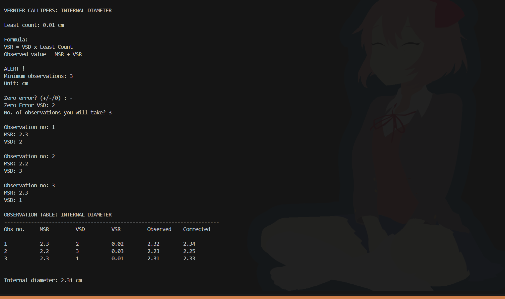
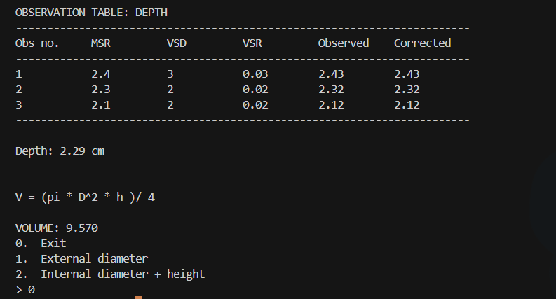

# Physics Practical Calculator (for high school students)

A Python terminal program designed to perform calculations used in physics practicals.
The project focuses on building **reusable, instrument-based tools** rather than hard-coding individual experiments.

## Current Implementation

### Vernier Callipers

The Vernier Callipers module currently supports:

* External diameter measurement
* Internal diameter measurement
* Depth/height measurement
* Multiple observations
* Observation table generation
* Mean of corrected observations
* Input validation
* Formula and experiment information display
* Positive and negative zero-error correction
* Cylindrical volume calculation using internal diameter and height
* Menu-driven interface

## Demo

### External Diameter


### Internal Diameter + Height → Cylindrical Volume





## Design Approach

The project follows an **instrument-oriented and reusable design**.

Instead of creating separate hard-coded functions for every experiment, the Vernier Callipers module can be used to obtain different measurements and pass those values into other calculations.

For example:

```text
Vernier Callipers
       │
       ├── Internal diameter
       │
       └── Depth/height
              │
              ↓
      Cylindrical volume
```

The goal is to make the computer handle repetitive calculations while the code defines the structure and logic of the experiment.

## Planned

* Add more measuring instruments
* Add more physics practical calculations
* Improve observation/error analysis
* Expand the menu system
* Improve input handling and validation

## Future Plan

The bigger goal is to gradually develop this into:

```text
Instrument Modules
        ↓
Physics Practical Calculator
        ↓
Student Experiment Toolkit
        ↓
Web Interface
```

The project will be developed step-by-step while keeping the code reusable, understandable, and practical for students.
