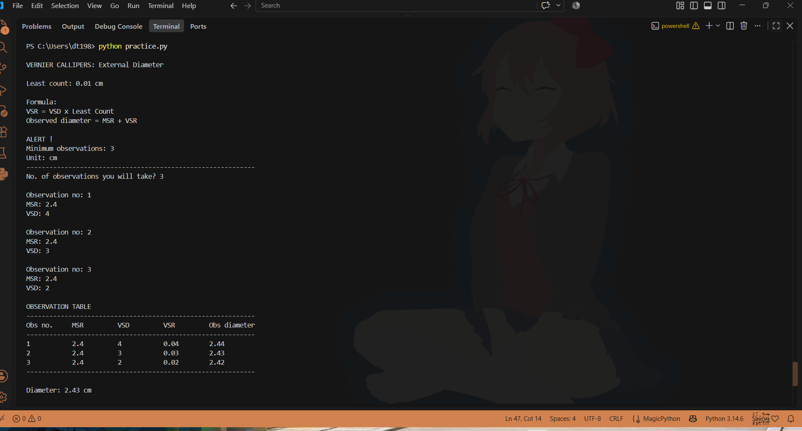

# Physics Practical Calculator (for high school students)

A Python terminal program designed to perform calculations used in physics practicals.

## Current implementation

### Vernier Callipers
- External diameter calculation
- Multiple observations
- Observation table
- Mean diameter
- Input validation
- Formula/information display

## Demo

## Planned
- Zero-error correction
- Internal diameter
- More physics practicals
- Menu-driven interface

## Future Plan (bigger picture)

> Vernier external diameter
> Vernier module
> Physics practical calculator
> Student experiment toolkit
> web interface
